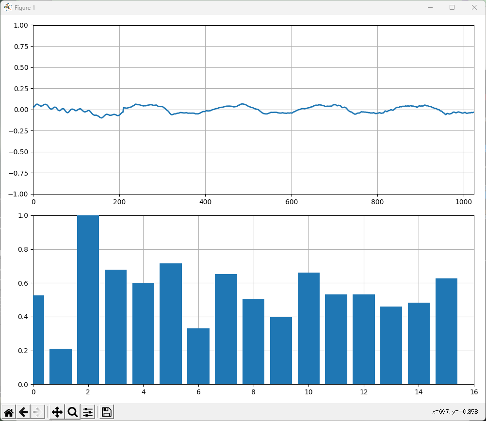

# OSC_audio_sampler
VRChat想定で、OSCで音声波形データを送りつける



# 環境構築

## pyenvの構築

https://qiita.com/probabilityhill/items/9a22f395a1e93206c846

ご参考まで


## 環境構築
```
$ pyenv install 
$ pyenv local 
# 3.7.9と出るはず

# 仮想環境を作成
$ python -m venv venv
$ .\venv\Scripts\Activate.ps1

# 仮想環境に周辺ライブラリをインストール
$ pip install -r requirements.txt
```

## 実行

```
$ python .\main.py
```
